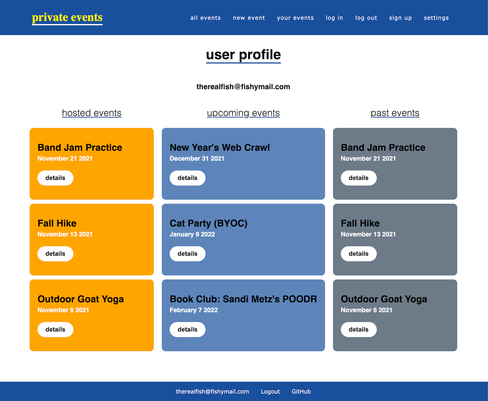

# Private Events

## Quick Take

An application from [The Odin Project's](https://www.theodinproject.com/paths/full-stack-ruby-on-rails/courses/ruby-on-rails/lessons/associations) Rails curriculum that focuses on the use of ActiveRecord's associations. This project aims to build an event app similar to Eventbrite where users can create and manage events, send private invitations, and attend events hosted by other users. It teaches more about ActiveRecord associations by requiring many-to-many relationships, foreign keys and custom class names.

## How it Works

In this app, people can create User accounts with an email and password (authentication is set up through the Ruby Devise gem). These Users can then create Events which are either public (open to anybody) or private (requiring an exclusive invitation). For public events, any user can click to attend the event from the event's show page. For private events, the creator of the event can select which users to send exclusive invitations. Those users who were invited can then click to accept the invite or not.

Creators of an event can edit or delete their events as well. Technically, creators can also edit an event to turn a public event into a private event or vice versa. But any users who had already clicked to attend an event when it was public will be grandfathered in with a private invitation.

## Demo Online

Check out this [Private Events](https://sleepy-citadel-75700.herokuapp.com/) app running on Heroku.



## Try It Local

* Ruby version 2.7.2
* Rails version 6.1.4

```ruby
$ git clone git@github.com:dm-murphy/private-events.git
$ bundle install
$ rails db:migrate

# Note: If Webpacker throws a MissingEntryError try the following command:
$ rake webpacker:install
```

## What Was Learned

Building this project helped me understand much more about the MVC process and ActiveRecord associations. In particular, it was tricky learning how to wrap my head around using through tables, but once I did, it made a lot more sense for approaching associations between models this way. 

I also learned about using simple scopes, building ActiveRecord queries and relying on partials to keep views clean and organized. 

Instead of using a CSS framework like Bulma, I decided to keep all the CSS vanilla and do my own styling for most of the Rails views. I left the Devise views in their default state but played around with my Event #index/#show views as well as the User #show view.

I pushed myself out of my comfort zone with this project in a few ways. Not only did I go after all the 'extra credit' steps for this assignment but I added on some more as well! I wanted the app not only to allow either public events or private events, but both! So I was able to distinguish between the Event models and build out the invitation process for either style. Additionally, I thought it silly that Users could still accept invitations to attend events that have already passed, so I made sure to limit this to upcoming events only.
